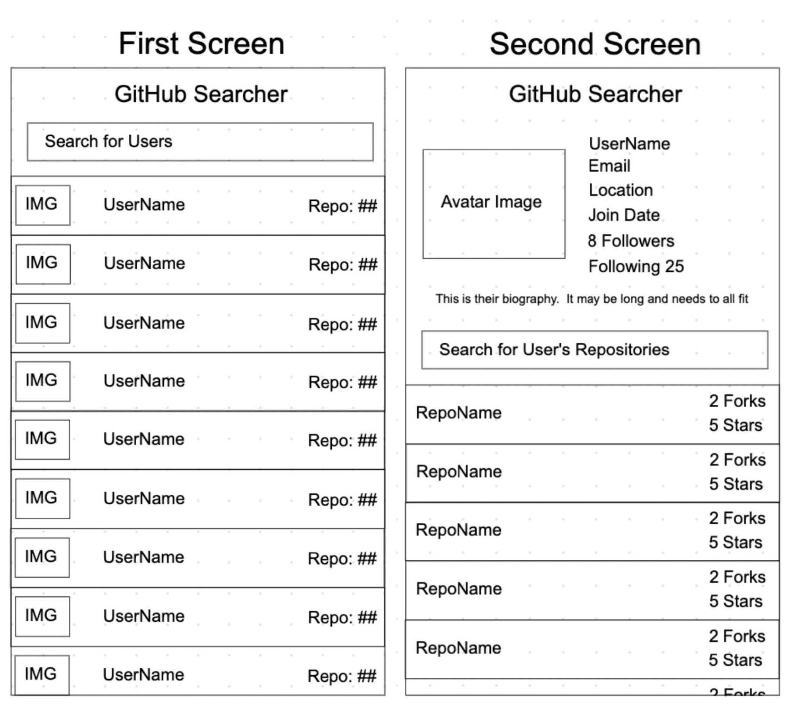

# GitHub user search App
## Atlana React Test Task 

[Deployed App on Netlify](https://github-searcher-user.netlify.app/)

Author: Vitalii Melnyk

## Technology Stack

- React with React Hooks
- TypeScript
- React styles & libraries: Material-UI
- Redux
- Redux-toolkit
- axios
- lodash.debounce
- react-toastify
- aos
__________________________________________________________________
## Technical Requirements
Please build a web application that is able to search through GitHub
users and their corresponding projects using the GitHub api:
https://docs.github.com/en/rest using React. The application
shall contain 2 screens.

The first screen will contain a search bar that can search through any
user on the GitHub website at the top with a list of results underneath.  
Each item should contain the avatar image, username, and the
number of repositories they have.  The list view shall not be
paginated.  Additionally, the search will automatically update upon
each letter entered.

Tapping on a user will bring up a screen that contains the profile
details of that user.  The view should contain their avatar image,
username, number of followers, number of following, biography, email,
location, join date, and a list of public repositories with a search bar a
t the top. Each item of the list view shall contain the name of the
repository, the number of stars, and the Number of forks. The search
bar will allow the user to search through the user’s repository. The list
view shall not be paginated. Additionally, the search will automatically
update upon each letter entered.

Tapping on a repository shall bring the user to a web browser and open
the repository in the GitHub website.
You shall be given 24 hours to complete this task.

The application will be used during the interview, please be ready to
explain and defend your choices for technologies and coding paradigms.
Nice to have - All results should be cached such that when going
back, the results should still be displayed on the previous screen.

The application shall be hosted on your own GitHub.

Also make sure that the application completely works before submitting it.

Preferable technology - TypeScript

Bonus Points:
● Please add something that seems “cool feature” for you. It could be
CSS animation, Typescript code snippet, color theme - anything you
want. Main requirement - realization time should not exceed 1 hour.

  _________________________________________________________
# Getting Started with Create React App

This project was bootstrapped with [Create React App](https://github.com/facebook/create-react-app).

## Available Scripts

In the project directory, you can run:

### `yarn start`

Runs the app in the development mode.\
Open [http://localhost:3000](http://localhost:3000) to view it in the browser.

The page will reload if you make edits.\
You will also see any lint errors in the console.

### `yarn test`

Launches the test runner in the interactive watch mode.\
See the section about [running tests](https://facebook.github.io/create-react-app/docs/running-tests) for more information.
# Getting Started with Create React Index

This project was bootstrapped with [Create React Index](https://github.com/facebook/create-react-app).

## Available Scripts

In the project directory, you can run:

### `yarn start`

Runs the app in the development mode.\
Open [http://localhost:3000](http://localhost:3000) to view it in the browser.

The page will reload if you make edits.\
You will also see any lint errors in the console.

### `yarn test`

Launches the test runner in the interactive watch mode.\
See the section about [running tests](https://facebook.github.io/create-react-app/docs/running-tests) for more information.

### `yarn build`

Builds the app for production to the `build` folder.\
It correctly bundles React in production mode and optimizes the build for the best performance.

The build is minified and the filenames include the hashes.\
Your app is ready to be deployed!

See the section about [deployment](https://facebook.github.io/create-react-app/docs/deployment) for more information.

### `yarn eject`

**Note: this is a one-way operation. Once you `eject`, you can’t go back!**

If you aren’t satisfied with the build tool and configuration choices, you can `eject` at any time. This command will remove the single build dependency from your project.

Instead, it will copy all the configuration files and the transitive dependencies (webpack, Babel, ESLint, etc) right into your project so you have full control over them. All of the commands except `eject` will still work, but they will point to the copied scripts so you can tweak them. At this point you’re on your own.

You don’t have to ever use `eject`. The curated feature set is suitable for small and middle deployments, and you shouldn’t feel obligated to use this feature. However we understand that this tool wouldn’t be useful if you couldn’t customize it when you are ready for it.

## Learn More

You can learn more in the [Create React Index documentation](https://facebook.github.io/create-react-app/docs/getting-started).

To learn React, check out the [React documentation](https://reactjs.org/).

### Code Splitting

This section has moved here: [https://facebook.github.io/create-react-app/docs/code-splitting](https://facebook.github.io/create-react-app/docs/code-splitting)

### Analyzing the Bundle Size

This section has moved here: [https://facebook.github.io/create-react-app/docs/analyzing-the-bundle-size](https://facebook.github.io/create-react-app/docs/analyzing-the-bundle-size)

### Making a Progressive Web Index

This section has moved here: [https://facebook.github.io/create-react-app/docs/making-a-progressive-web-app](https://facebook.github.io/create-react-app/docs/making-a-progressive-web-app)

### Advanced Configuration

This section has moved here: [https://facebook.github.io/create-react-app/docs/advanced-configuration](https://facebook.github.io/create-react-app/docs/advanced-configuration)

### Deployment

This section has moved here: [https://facebook.github.io/create-react-app/docs/deployment](https://facebook.github.io/create-react-app/docs/deployment)

### `yarn build` fails to minify

This section has moved here: [https://facebook.github.io/create-react-app/docs/troubleshooting#npm-run-build-fails-to-minify](https://facebook.github.io/create-react-app/docs/troubleshooting#npm-run-build-fails-to-minify)
